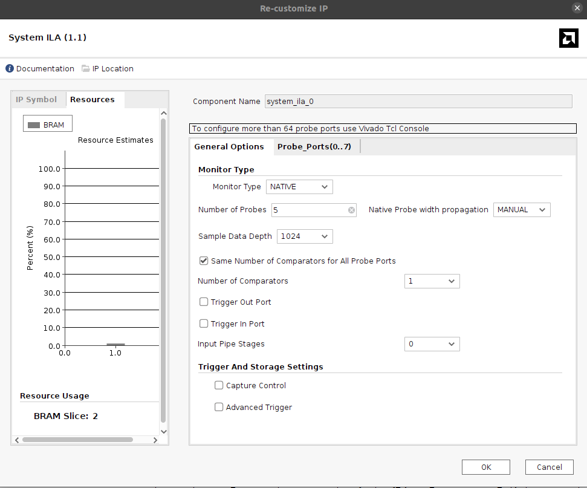
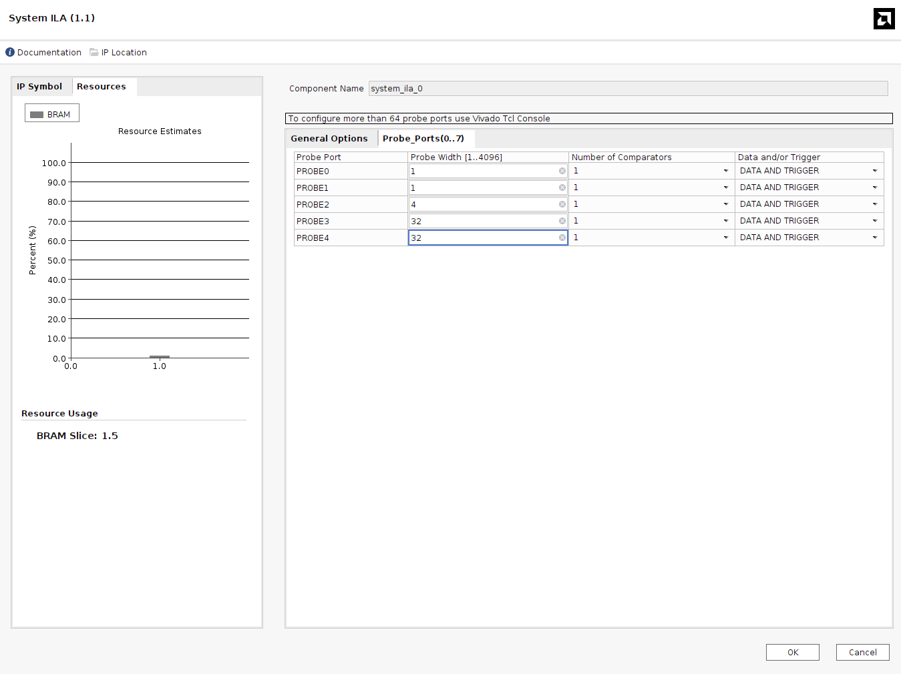
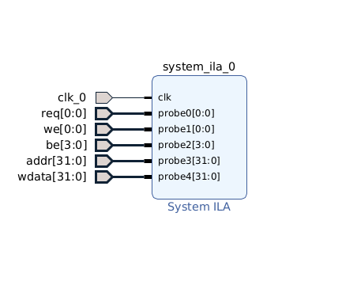
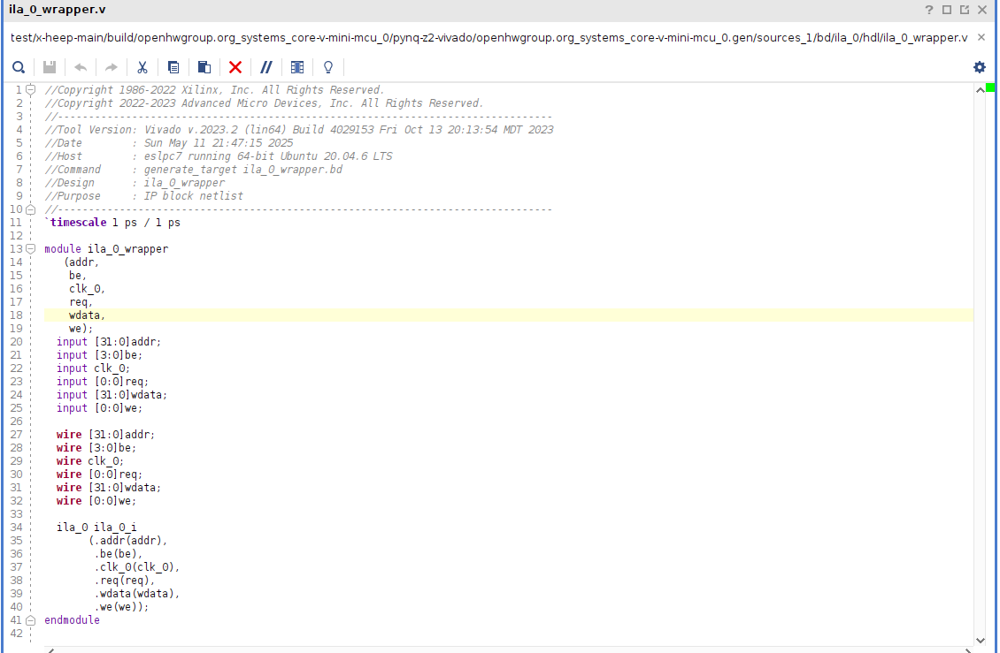

## Using ILA for Debugging in Vivado

### 🧠 What is the Integrated Logic Analyzer (ILA)?

The **Integrated Logic Analyzer (ILA)** is a built-in debug core in Vivado that allows real-time observation of internal FPGA signals. It works like a digital oscilloscope inside the FPGA, capturing signal transitions based on customizable trigger conditions. This enables you to debug and analyze logic behavior without needing external test equipment or adding temporary output pins.

---

### 🛠️ Debugging X-HEEP on FPGA with ILA

To debug the **X-HEEP** SoC running on an FPGA like the ZCU104 using the ILA tool:

1. **Insert the ILA Core**

   - Open your Vivado project (you need your precompiled bitstream—please refer to the [Bitstream Generation Guide](./../RunOnFPGA.md)).
   - Click on **Create Block Design** and name it so that you can easily find it later.
   - Press **+** and search for **System ILA**.
   - Double-click to configure the IP. In **General Options**, choose **Monitor Type** as **Native** to customize your signal probes (interface used for AXI signals). For native probe width propagation, you can leave it as **AUTO**. If you choose **Manual**, you will need to manually specify the bit width of each signal. The **Number of Probes** corresponds to the number of signals you want to monitor. 
   <div align="center">
     
     <p><em>Figure 1: Example General Options ILA.</em></p>
   </div>
   
   For example, to observe the OBI `obi_req_t` structure:

   ```systemverilog
   typedef struct packed {
     logic        req;
     logic        we;
     logic [3:0]  be;
     logic [31:0] addr;
     logic [31:0] wdata;
   } obi_req_t;

2. **Configure Probes**
   - Inside the Probe_Ports if you have chosen "Manual" probe width propagation you need to manually specify the signals length. In most of the cases you can keep number of comparators to 1, you need  to modify this parameter only if you want to catch this signal being equal to different signals (FSM case). Please refer to the ILA documentation.
   <div align="center">
     
     <p><em>Figure 1: Example General Options ILA.</em></p>
   </div>
   - To keep the IP clean and tidy right click and **make external**. This will allow you to rename the probes and to extract the VHDL script which you will be able to connect within your RTL.
    <div align="center">
        
        <p><em>Figure 1: Example General Options ILA.</em></p>
    </div>

   - Save it and close it.

4. **Generate RTL wrapper**
   - Inside **Hierarchy** find the ila you just generated (if it is not visible try to click update IP sources).
   - Right click **Create HDL Wrapper**  (In our case we need to connect the ILA within the RTL since X-HEEP does not allow you to see the whole Block Diagram due to the diversity of the HDL languages. For this case we create the HDL wrapper which is needed to beconnected inside the RTL modules).
   <div align="center">
     
     <p><em>Figure 1: Example General Options ILA.</em></p>
   </div>

5. **Connect ILA to your RTL**
   - Connect it to the signals within your RTL by instantiation the ILA module same way as you do for any other module.

6. **Generate Bitstream**
   - You need to synthesize, implement, and regenerate the bitstream with the ILA logic included.

7. **Program the Board**
   - Open *Hardware Manager* and program the FPGA with the new bitstream.

8. **Use the ILA Debugger**
   - In *Hardware Manager*, connect to the FPGA and open the ILA core view.
   - Set up triggers (e.g., rising edge of `valid`, or value match on `address`).
   - Run a capture and inspect the waveforms of your internal signals.

---

### ✅ Tipzzzzzzz

Use ILA especially when debugging:
- AXI transactions
- Handshakes in the instruction or data interfaces.
- **Timing issues** or unexpected behavior in custom logic (your simulation works, but FPGA fails).
- [Refer to the AMD Documentation](https://docs.amd.com/r/en-US/ug936-vivado-tutorial-programming-debugging/Using-the-Vivado-Integrated-Logic-Analyzer)


